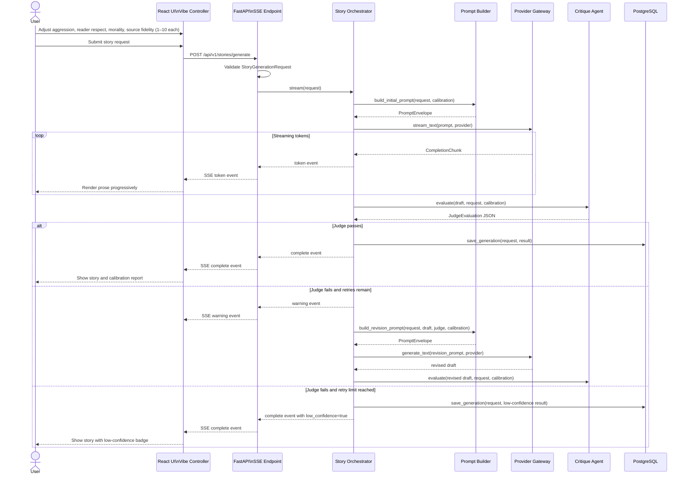

# LoreForge Architecture

LoreForge should keep HTTP transport, orchestration, and provider integration separate so the story engine can evolve without rewriting the API. The FastAPI application is responsible for validation, authentication, rate limiting, persistence coordination, and SSE transport. The orchestration layer owns prompt construction, provider routing, streaming token assembly, judge evaluation, and bounded revision loops.

## Layer Boundaries

```text
React + shadcn/ui
  -> FastAPI transport layer
    -> Story orchestration service
      -> Provider adapters
      -> Judge agent
      -> PostgreSQL persistence
```

### Transport Layer

- Accepts the UI-facing 1–10 slider payload (four metrics: aggression, reader_respect, morality, source_fidelity).
- Accepts a custom story brief and optional public title alongside calibration input.
- Converts slider values into normalized 0.0–1.0 controls (divide by 10).
- Emits server-sent events for generation progress and final result delivery.
- Stores the original slider payload, optional public title, and normalized vibe profile with each story row.

### Orchestration Layer

- Depends on typed protocols instead of provider SDK classes.
- Builds prompts from a calibration profile rather than raw request JSON.
- Supports streaming generation for long-form output.
- Calls a separate judge model for structured metric verification.
- Retries revisions with a hard cap to avoid infinite critique loops.

### Provider Layer

- Hides OpenAI, Anthropic, Gemini, and Ollama behind one internal gateway.
- Keeps framework lock-in contained to the adapter boundary.
- Allows LangChain to be swapped later because the domain contracts stay local to the repository.

## Calibration Edge Cases

- Neutral collapse: midpoint settings across all metrics often produce generic prose. The prompt builder should inject a deliberate baseline style instead of letting the model drift into blandness.
- Stern but respectful tension: high aggression plus high reader respect is valid, but it should read as forceful professionalism rather than abuse.
- Moralized lecturing: high morality plus low reader respect tends to produce preachy narration and needs judge scrutiny.
- Clinical detachment: low morality plus high reader respect can flatten emotional stakes into sterile prose.
- Long-form drift: stories above a few thousand words lose tone fidelity unless the orchestration loop re-anchors the vibe profile across chunks or revisions.
- Genre interference: the same numeric profile should not produce identical voice across fantasy, noir, and romance, so genre must influence the prompt template.
- Character versus narrator separation: the system must treat vibe metrics as narrative voice controls, not as hard constraints on every character's dialogue.
- Extreme values: values of 1 or 9–10 on the 1–10 scale should remain allowed, but the judge must verify that the result stayed coherent and policy-safe.
- Source fidelity at minimum (1–2): when source_fidelity is strongly minimized the model treats the source tales as loose inspiration only; the judge cannot verify fidelity and should not flag invented plot as an error.
- Source fidelity at maximum (9–10): near-canonical retelling means vibe reshaping is the only creative freedom; the judge should scrutinize whether the requested tone is compatible with the source material.

## Dynamic Prompting vs. RAG

Phase 1 should use pure dynamic prompting.

- There is no existing story corpus to retrieve from, so a vector index adds infrastructure cost without adding grounding value.
- Vibe control is primarily a style-calibration problem, not a retrieval problem.
- Streaming is simpler when the generator is not blocked on retrieval, ranking, and chunk assembly.
- A judge loop is easier to reason about when it evaluates prompt intent directly rather than intent mixed with retrieved passages.

RAG becomes useful later when LoreForge needs lore consistency, world-state grounding, or similarity search over prior stories. If retrieval is added in Phase 2, use it for lore grounding first. Do not use retrieved prose as style guidance unless it is explicitly labeled with genre and vibe metadata, or it will fight the requested controller settings.

## Persistence Notes

Store the user-facing slider payload and the normalized calibration state together.

```sql
CREATE TABLE stories (
    id UUID PRIMARY KEY,
    public_title TEXT,
    content TEXT NOT NULL,
    vibe_profile JSONB NOT NULL,
    normalized_vibe JSONB NOT NULL,
    judge_report JSONB NOT NULL,
    revision_count INTEGER NOT NULL DEFAULT 0,
    low_confidence BOOLEAN NOT NULL DEFAULT FALSE,
    created_at TIMESTAMPTZ NOT NULL DEFAULT NOW()
);
```

`public_title` preserves the user-facing story name, `vibe_profile` supports direct replay in the UI, and `normalized_vibe` keeps the orchestration layer independent from presentation concerns.

## Sequence Diagram


